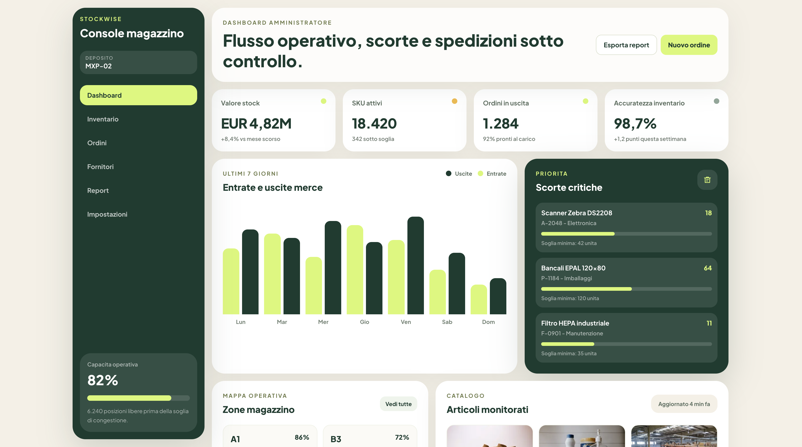
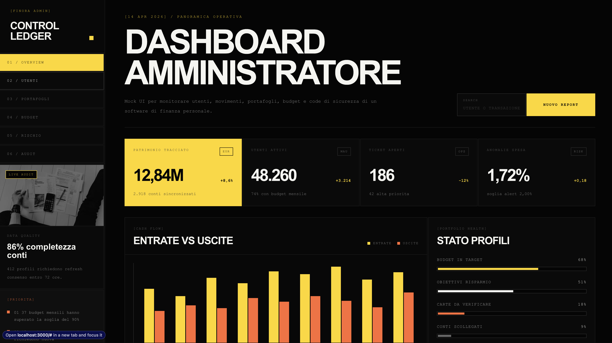

# DesignAI Skills

DesignAI Skills e' una raccolta di direzioni UI/UX pensate per aiutare agenti AI, coding assistant e generatori di interfacce a produrre software con identita' visive diverse, coerenti e professionali.

Ogni cartella e' una skill di stile: contiene screenshot di riferimento, una documentazione essenziale in `README.md` e una skill Codex sotto `.agents/skills/project-ui-design/`.

## Stili inclusi

```text
.
+-- neo-brutalist-paper/
|   +-- README.md
|   +-- dashboard-overview.png
|   +-- task-board-wide.png
|   +-- task-board-detail.png
+-- warm-fintech-minimalism/
|   +-- README.md
|   +-- inventory-dashboard-overview.png
|   +-- inventory-sections-detail.png
+-- industrial-ledger-console/
|   +-- README.md
|   +-- finance-admin-overview.png
|   +-- cashflow-ledger-detail.png
+-- terminal-ide-monochrome/
    +-- README.md
    +-- revenue-ops-dashboard.png
    +-- revenue-signal-action-queue.png
```

## Neo-Brutalist Paper

Direzione paper e neo-brutalist per dashboard operative: superfici bianche, bordi neri pesanti, ombre offset nette, headline grandi e accenti primari molto controllati.

Ideale per task board, planning, CRM leggeri, strumenti interni e prodotti che devono sembrare diretti, energici e memorabili.


## Warm Fintech Minimalism

Direzione premium e calma per prodotti data-heavy: canvas crema, card bianche arrotondate, verde foresta, accenti lime, grafici morbidi e gerarchia finanziaria pulita.

Ideale per finance, inventory, operations, supply chain, analytics e gestionali dove fiducia e chiarezza contano piu' dell'effetto wow.



## Industrial Ledger Console

Direzione scura, tecnica e finanziaria: nero industriale, pannelli squadrati, tipografia display massiva, microcopy mono, giallo come accento primario e arancione per segnali secondari.

Ideale per audit, risk, compliance, budgeting, trading, monitoring finanziario e dashboard con metriche ad alta priorita'.



## Terminal IDE Monochrome

Direzione terminal-native per prodotti tecnici: nero/navy, pannelli rettangolari, bordi sottili, font mono, status semantici sobri e workflow da command center.

Ideale per dev tools, observability, SaaS ops, incident management, control plane e dashboard interne per utenti esperti.


## Come usare una skill

Scegli la cartella piu' adatta al prodotto da generare e passa il relativo `README.md` o `SKILL.md` come contesto all'agente AI.

Esempio:

```text
Usa la skill "Industrial Ledger Console" di questo repository.
Crea una dashboard risk per un prodotto fintech, mantenendo palette,
tipografia, geometria, gerarchia e componenti coerenti con le reference.
```

Per ottenere risultati migliori, specifica sempre:

- tipo di prodotto;
- pubblico di riferimento;
- funzionalita' principali;
- densita' desiderata;
- vincoli di accessibilita';
- framework o design system da rispettare.

## Cosa contiene ogni README

Ogni README di stile documenta:

- quando usare la skill;
- identita' visiva;
- palette essenziale;
- font consigliati;
- componenti chiave;
- regole operative;
- pattern da evitare;
- screenshot reference incorporati.

## Principi comuni

Indipendentemente dallo stile, ogni UI generata dovrebbe rispettare questi fondamentali:

- gerarchia chiara;
- contrasto leggibile;
- stati hover, focus, active, disabled ed error;
- layout responsive;
- target interattivi accessibili;
- copy concreta e orientata all'azione;
- componenti coerenti tra loro;
- estetica riconoscibile senza sacrificare usabilita'.
