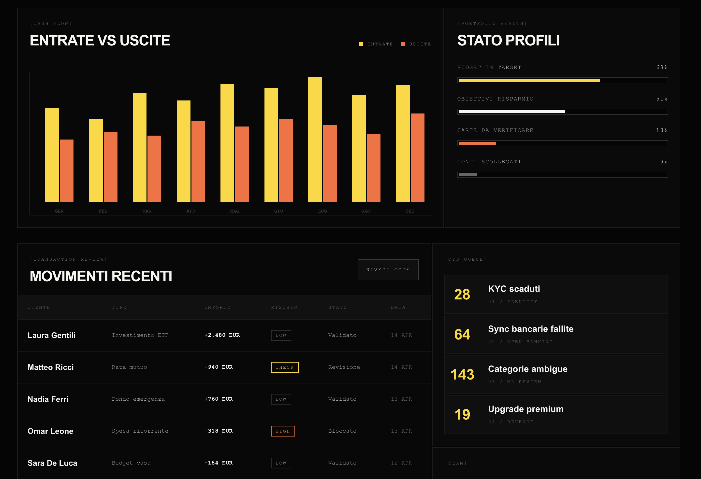

# Industrial Ledger Console

Skill UI/UX per dashboard scure, finanziarie e tecniche: nero industriale, griglie squadrate, tipografia display massiva, microcopy mono, giallo come accento primario e arancione come segnale secondario.

## Quando usarla

- Fintech, audit, risk, trading, compliance, budgeting e strumenti di controllo.
- Prodotti che devono sembrare precisi, severi, tecnici e ad alta priorita'.
- Interfacce con metriche, grafici, code operative, alert e tabelle dense.

## Identita' visiva

- Canvas: nero quasi assoluto.
- Struttura: pannelli squadrati, bordi sottili, nessun effetto floating.
- Gerarchia: headline enormi, numeri grandi, label mono bracketed.
- Colore: giallo per focus e azione primaria, arancione per warning o differenze.
- Ritmo: grandi spazi pagina, ma componenti interni meccanici e compatti.

## Palette

- Background: `#050505`, `#080808`, `#0A0A0A`
- Surface: `#0D0D0D`, `#111111`, `#1A1A1A`
- Border: `#1D1D1D`, `#2D2D2D`, `#3D3D3D`
- Primary text: `#F5F5F0`
- Muted text: `#888888`, `#666666`, `#444444`
- Yellow primary: `#FFD600`
- Orange secondary: `#FF6B35`

Regola pratica: l'interfaccia resta quasi tutta nera e grigia; giallo e arancione devono essere segnali, non decorazione.

## Tipografia

- Display / numeri / CTA: `Space Grotesk`, bold o extra-bold.
- Metadata / label / tabelle: `IBM Plex Mono`.
- Label: uppercase, bracketed, con letter spacing.
- Headline: molto grandi, line-height stretto.
- Tabelle: mono leggibile, allineamenti stabili, tabular figures quando possibile.

## Componenti chiave

- Sidebar scura con voci numerate e stato attivo giallo.
- Hero o header con headline massiva e data operativa mono.
- KPI tiles squadrati con bordo sottile e stato evidenziato.
- Grafici a barre con giallo/arancione su canvas nero.
- Tabelle ledger con colonne fisse, risk badge e azioni outline.
- Code operative con numeri grandi e descrizioni brevi.

## Regole operative

- Radius predefinito: `0px`; usa rotondita' solo per dot o indicatori minimali.
- Usa bordi e contrasto superficie invece di shadow.
- Non usare gradienti, blur, glassmorphism, card morbide o palette SaaS blu/viola.
- Mantieni una scansione veloce: label piccola, valore grande, stato chiaro.
- Gli stati critici devono avere testo oltre al colore.

## Reference

