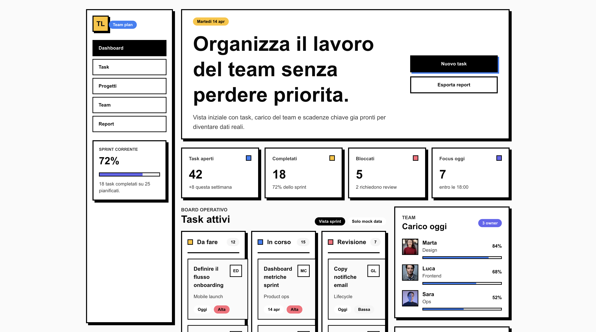
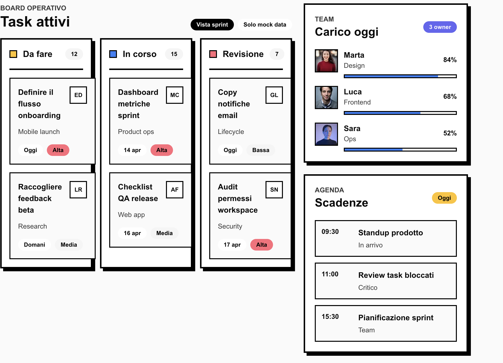
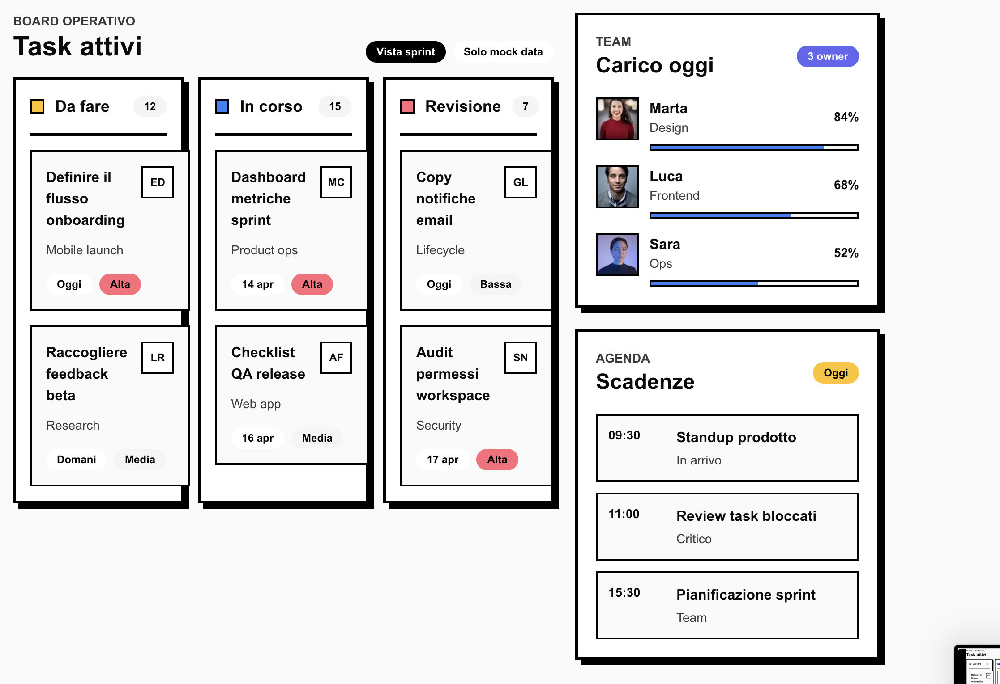

# Neo-Brutalist Paper

Skill UI/UX per interfacce operative con estetica paper e neo-brutalist: superfici bianche, bordi neri pesanti, ombre offset nette, tipografia grande e accenti primari usati come segnali.

## Quando usarla

- Dashboard operative, task board, planning di team, CRM leggeri e strumenti interni.
- Prodotti che devono sembrare diretti, energici, chiari e memorabili.
- UI con molte card, metriche, liste, colonne e azioni principali evidenti.

## Identita' visiva

- Canvas: bianco o bianco caldo, con molto spazio negativo.
- Struttura: bordi neri da 3-4 px, linee nette, ombre offset nere senza blur.
- Forme: rettangoli decisi, radius basso o medio, pill solo per badge e filtri.
- Gerarchia: headline molto grandi, numeri ampi, label corte e card modulari.
- Accenti: pochi colori saturi per stato, categoria o priorita'.

## Palette

- Background: `#FFFFFF`, `#F7F7F5`
- Ink / bordi: `#050505`, `#111111`
- Testo secondario: `#3D3D3D`, `#555555`
- Blue action: `#2F81F7`
- Yellow highlight: `#FFC224`
- Pink / danger: `#FF5C74`
- Indigo support: `#6457F3`

Regola pratica: il bianco e il nero costruiscono il sistema; gli accenti colorati devono restare localizzati in badge, piccoli quadrati, barre, chip e CTA.

## Tipografia

- Font consigliati: `Onest`, `Inter`, `Plus Jakarta Sans`, `Satoshi`.
- Pesi: 600-800 per titoli, bottoni, label e numeri; 400-500 per descrizioni.
- H1: molto grande, compatto, con line-height stretto.
- Label: corte, spesso uppercase o semi-bold.
- Mono: solo per ID, codici, sigle o micro-dati.

## Componenti chiave

- Sidebar con item rettangolari, stato attivo pieno nero.
- Card KPI con bordo nero, ombra offset e piccolo marker colore.
- Task card con titolo forte, sigla owner, chip data/priorita'.
- Pulsanti primari neri o blu, secondari outline con bordo nero.
- Progress bar lineari con bordo nero e fill saturo.
- Tabelle e liste con separatori netti, non con ombre morbide.

## Regole operative

- Mantieni una sola azione primaria dominante per sezione.
- Usa grid regolari e spaziatura generosa per evitare caos visivo.
- Non usare gradienti, glassmorphism, blur shadow o palette pastello.
- Non arrotondare troppo: lo stile deve restare deciso e fisico.
- Verifica sempre contrasto, focus state e target touch.

## Reference

