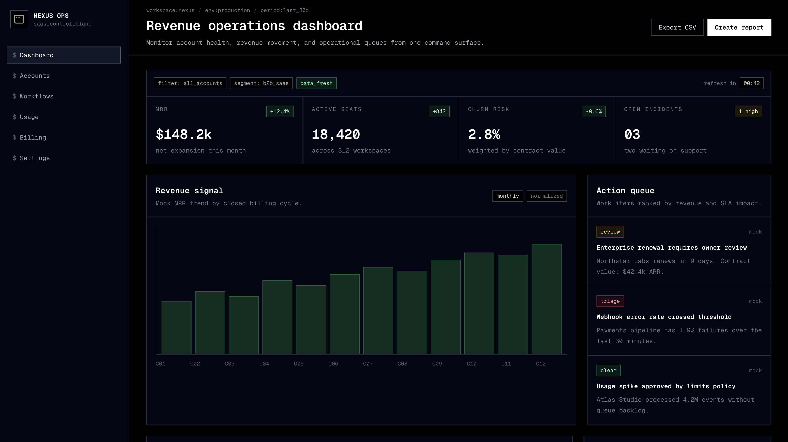
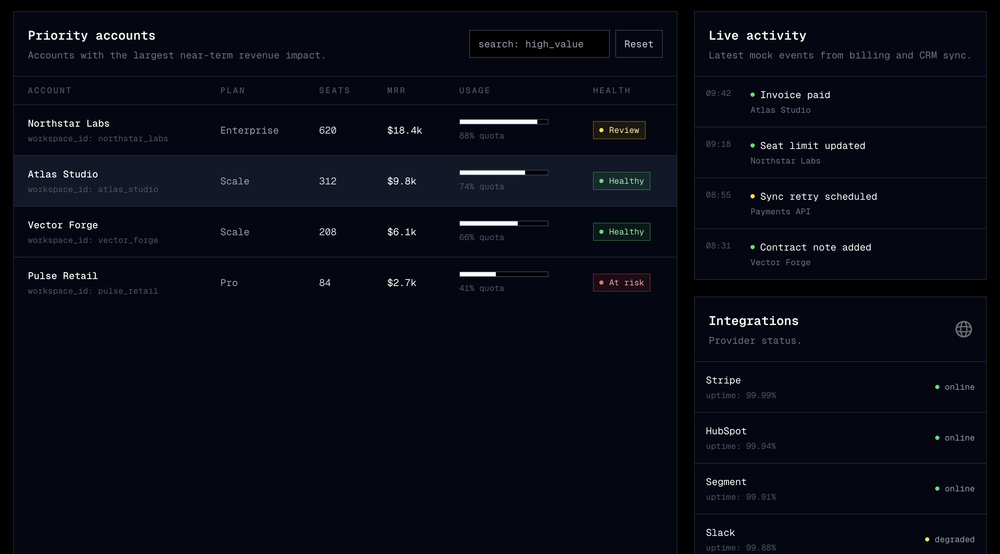

# Terminal IDE Monochrome

Skill UI/UX per prodotti tecnici con identita' terminale: nero e navy, testo mono, pannelli rettangolari, bordi sottili, stati semantici sobri e controlli da command center.

## Quando usarla

- Dev tools, observability, SaaS ops, control plane, incident management e dashboard interne.
- Interfacce per utenti esperti che devono leggere stato, filtri, code e metriche rapidamente.
- Prodotti dove il linguaggio "terminal/IDE" e' parte del valore percepito.

## Identita' visiva

- Canvas: nero o navy quasi nero.
- Superfici: pannelli scuri con bordi grigio-blu.
- Geometria: rettangolare, tecnica, con radius minimo.
- Gerarchia: titoli mono bianchi, metadata grigi, status colorati con parsimonia.
- Interazione: hover su bordo/surface, focus visibile, feedback locale e rapido.

## Palette

- Background: `#02040A`, `#050915`, `#080D18`
- Surface: `#0B1120`, `#111827`, `#141B2A`
- Border: `#1F2937`, `#334155`, `#475569`
- Primary text: `#F9FAFB`, `#F3F4F6`
- Muted text: `#9CA3AF`, `#6B7280`
- Success: `#4ADE80`
- Warning: `#FACC15`
- Danger: `#FB7185`
- Link / path: `#60A5FA`

Regola pratica: 85-90% della UI deve restare monocromatica; colore solo per stato, alert, focus o link tecnico.

## Tipografia

- Font consigliati: `IBM Plex Mono`, `JetBrains Mono`, `Geist Mono`, `Roboto Mono`.
- Mono come default per nav, titoli, label, tabelle, metriche e controlli.
- Sans opzionale solo per paragrafi lunghi.
- Dimensioni compatte: `text-sm` come base, `text-xs` per metadata, titoli `text-lg`/`text-xl`.
- Numeri e metriche con allineamento tabulare.

## Componenti chiave

- Sidebar control-plane con icone semplici e item attivo bordered.
- Header con path operativo, ambiente, periodo e azioni CSV/report.
- Pannelli KPI in griglia con filtri inline e timer.
- Grafici scuri con assi sottili e barre verdi/monocrome.
- Action queue con badge `review`, `triage`, `clear`.
- Tabelle e log list con righe alte 40-48 px.

## Regole operative

- Usa bordi come principale sistema di separazione.
- Mantieni pannelli e CTA squadrati o con radius minimo.
- Evita estetica retro decorativa: deve sembrare un prodotto tecnico reale.
- Non introdurre card bianche, gradienti, ombre morbide o colori decorativi.
- Ogni stato deve avere label testuale oltre al colore.

## Reference

