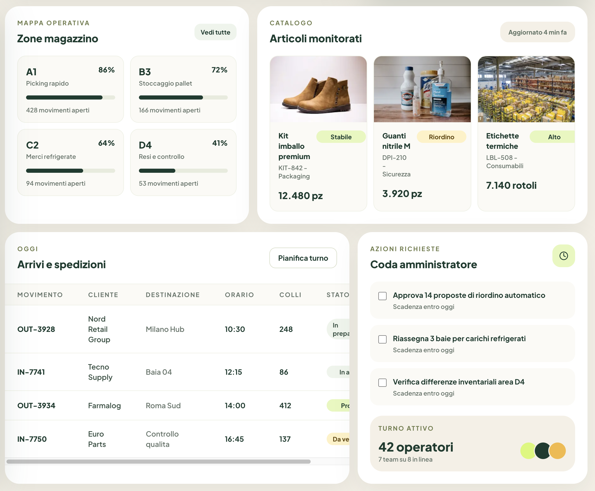

# Warm Fintech Minimalism

Skill UI/UX per interfacce premium, calme e operative: canvas crema, superfici bianche morbide, verde foresta, lime come accento, radius ampio e gerarchia finanziaria pulita.

## Quando usarla

- Dashboard finance, inventory, operations, analytics, supply chain e strumenti gestionali.
- Prodotti che devono comunicare fiducia, controllo e qualita' senza sembrare freddi.
- Esperienze data-heavy che richiedono leggibilita' e una percezione piu' calda del classico SaaS.

## Identita' visiva

- Canvas: crema caldo, mai bianco puro dominante.
- Superfici: card bianche o off-white con radius grande.
- Struttura: separazione tramite spaziatura, tono superficie e shadow morbida, non tramite bordi duri.
- Gerarchia: numeri grandi, heading verde scuro, metadata grigio-verde.
- Accenti: lime per CTA, stato positivo, indicatori attivi e grafici.

## Palette

- Background caldo: `#F2EEE3`, `#ECE7DA`
- Surface: `#FFFFFF`, `#FAFAF6`
- Forest primary: `#0E3A2B`, `#143F30`
- Muted sage: `#68756A`, `#879284`
- Lime accent: `#D9FF52`, `#CFF451`
- Amber warning: `#F3B63F`
- Border soft: `#E4E0D4`, `#D5D0C2`

Regola pratica: forest e crema definiscono il carattere; lime deve evidenziare solo cio' che e' azionabile, attivo o positivo.

## Tipografia

- Font consigliato: `Plus Jakarta Sans`.
- Alternative: `Manrope`, `Inter`, `Satoshi`.
- Titoli e metriche: extra-bold, compatti, verde foresta.
- Label: piccole, semi-bold, spesso con letter spacing leggero.
- Body e metadata: muted, leggibili, mai troppo sottili.

## Componenti chiave

- Sidebar scura verde foresta con item pill e stato attivo lime.
- Card KPI bianche con radius 24-32 px e indicatori colorati.
- Grafici con barre arrotondate e pochi colori.
- Tabelle ampie con righe morbide, chip stato e spacing generoso.
- Product card con immagini, tag pill e metriche evidenti.
- CTA principali lime, secondarie outline soft.

## Regole operative

- Usa radius ampio in modo coerente: card grandi 24-36 px, controlli 12-18 px.
- Evita bordi neri, ombre dure, neon e contrasti aggressivi.
- Mantieni densita' compatta ma respirabile.
- Dai priorita' a valori, stato e prossima azione.
- Non trasformare ogni elemento in un pill: usa le pill per stato, filtri e CTA.

## Reference

